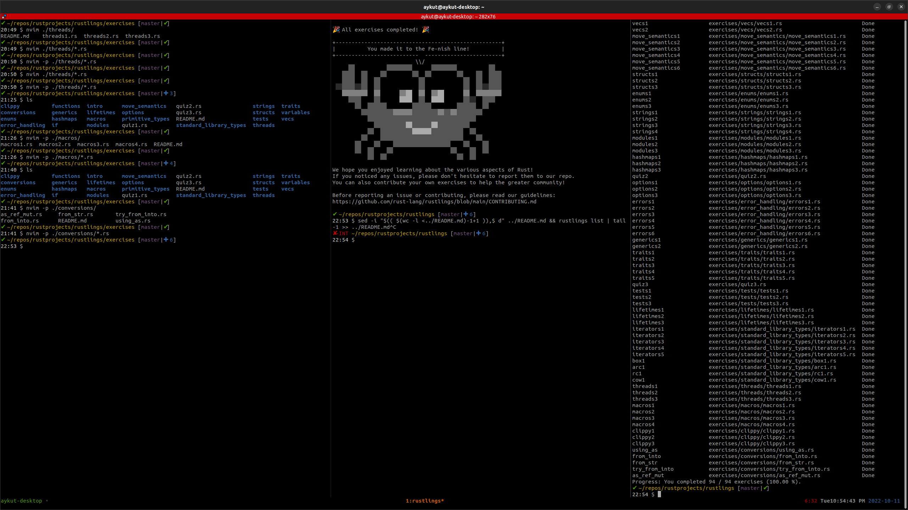

 

# Learning Rust

Hitherto, I have gone through the main [Rust book](https://doc.rust-lang.org/stable/book/title-page.html) and the rustling exercises in [rustlings](https://github.com/rust-lang/rustlings).

Progress: You completed 94 / 94 exercises (100.00 %).
